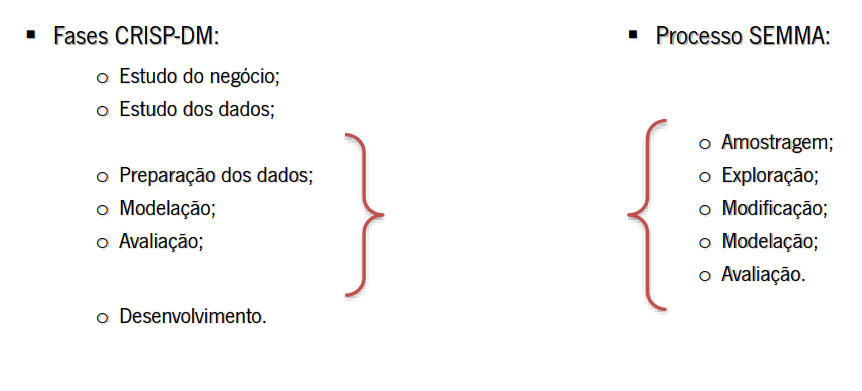

# Metodologias de Análise de Dados

Uma _Metodologia para Análise de Dados_ descreve e criam um conjunto de passos pelos quais deverá passar o desenvolvimento de um *Projeto de Aprendizagem Automática (Machine Learning)* para a resolução de problemas.

## Benefícios

- Garante maior robustez;
- Facilita a suar compreensão, implementação e desenvolvimento;
- Auxilia no planeamento e gestão do projeto;
- Permite a replicação de processos;
- ...

# Metodologias

## CRISP-DM (Cross-Industry Standard Process for Data Mining)

O CRISP-DM é uma metodologia de análise de dados que descreve as fases de um projeto de aprendizagem automática. Esta metodologia é composta por 6 fases:

1. **Estudo do Negócio (Business Understanding)**;
2. **Estudo dos Dados (Data Understanding)**;
3. **Preparação dos Dados (Data Preparation)**;
4. **Modelação (Modeling)**;
5. **Avaliação (Evaluation)**;
6. **Desenvolvimento (Deployment)**.

### Estudo do Negócio (Business Understanding)

Compreensão dos objetivos do projeto e definição do problema de Análise de Dados.

### Estudo dos Dados (Data Understanding)

Obter os dados e identificar a sua qualidade.

### Preparação dos Dados (Data Preparation)

Seleção, limpeza e transformação dos dados.

### Modelação (Modeling)

Experimentação com as ferramentas de Análise de Dados.

### Avaliação (Evaluation)

Comparação dos resultados obtidos com os objetivos do negócio.

### Desenvolvimento (Deployment)

Colocação do modelo em produção.

## SEMMA (Sample, Explore, Modify, Model and Assess)

Metodologia criada pela SAS Institute e teve como motivação a necessidade de definir, padronizar e integrar sistemas ou processos de Data Mining nos ciclos de produção.

Divide o processo de Data Mining em 5 fases:

1. **Amostragem (Sample)**:
    - Extração de dados do universo do problema;
    - Baseio o processo de _Data Mining_ no conceito de amostragem;
    - Amostra pequena e significativa;
    - Proporciona flexibilidade e rapidez no tratamento de dados.

2. **Exploração (Explore)**:
    - Exploração visual e/ou numérica das tendências;
    - Refinamento do processo de descoberta (mining);
    - Técnicas estatísticas: regressão linear, mínimos quadrados, distribuição de Poisson, etc;
    - Procura de tendências imprevistas nos dados.

3. **Modificação (Modify)**:
    - Concentração de todas as modificações necessárias;
    - Inclusão de informação;
    - Seleção ou introdução de novas variáveis;
    - Objetivo: criar, selecionar e adaptar variáveis para a próxima etapa.

4. **Modelação (Model)**:
    - Definição das técnicas de modelação: redes neuronais artificiais, regressão linear, etc;
    - Dependente do tipo de dados presentes em cada modelo.

5. **Avaliação (Assess)**:
    - Aferição do desempenho do modelo construído para _Data Mining_;
    - Aplicação do modelo a uma amostra de dados de teste;
    - Procedimento de ajuste do modelo.

# Comparação das Fases das Metodologias

A metodologia CRIPS-DM é mais abrangente e detalhada que a SEMMA, sendo esta última mais focada na modelação dos dados.
Assim sendo, uma comparação válida entre as fases das duas metodologias seria:

- Estudo do negócio e estudo dos dados é único na CRISP-DM;
- Preparação dos dados, modelação e avaliação do CRISP-DM correspondem a todo o processo SEMMA;
- Desenvolvimento do CRISP-DM não tem correspondência na SEMMA.

A imagem seguinte ilustra a comparação entre as duas metodologias:

