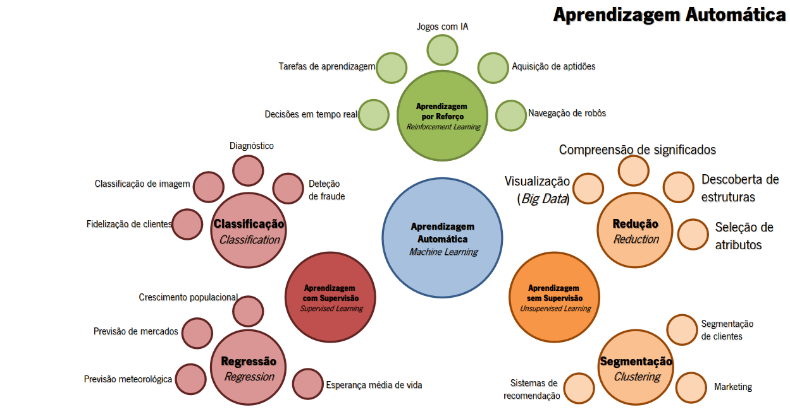
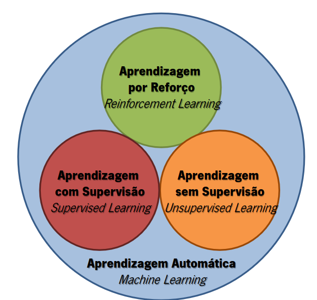

# Paradigmas de Aprendizagem Automática

Antes de começar a falar sobre os paradigmas de aprendizagem automática, é importante perceber o que é a aprendizagem automática e, para isso, é necessário perceber o que é a inteligência artificial.

# Inteligência Artificial

A **Inteligência Artificial (IA)** é um ramo da informática que estuda o desenvolvimento de sistemas computacionais com base no conhecimento humano. O objetivo da IA é desenvolver algoritmos que permitam aos computadores realizar tarefas que, quando realizadas por humanos, requerem inteligência.

A abordagem da IA pode ser dividida em dois paradigmas:

- **Simbólico**: baseado em regras e lógica;

- **Sub-simbólico/ Não Simbólico**: resolve problemas com base no conhecimento passado ou dados sobre a resolução de outros problemas.

## Big Data

**Big Data** é um termo popularizado para se referir a dados em grande quantidade e complexidade para serem tratados por abordagens tradicionais de computação. O Big Data é caracterizado por 3 Vs:

- **Volume**: quantidade de dados;
- **Velocidade**: rapidez com que os dados são gerados e processados;
- **Variedade**: diferentes tipos de dados.

# Aprendizagem Automática (Machine Learning)

A **Aprendizagem Automática (Machine Learning)** é um subcampo da IA que se concentra no desenvolvimento de algoritmos e técnicas que permitem aos computadores aprender a partir de dados. A aprendizagem automática pode tanto seguir uma abordagem simbólica como sub-simbólica.

## Soft Computing vs Hard Computing

O modelo subjacente a _Soft Computing_ é a mente humana, no sentido de que é capaz de lidar com incerteza, imprecisão e aproximação. O _Hard Computing_ é baseado em lógica booleana e é incapaz de lidar com incerteza e imprecisão.

## Algoritmos Genéticos

Os **Algoritmos Genéticos** são uma técnica de otimização inspirada na teoria da evolução de Darwin. Estes algoritmos são usados para resolver problemas de otimização e busca e utilizam um procedimento iterativo que mantém uma população de estruturas _candidatas a soluções_, para domínios específicos.

A cada incremento de tempo (geração), os algoritmos genéticos avaliam as soluções candidatas, selecionam as melhores e aplicam operadores genéticos (cruzamento, mutação e seleção) para gerar novas soluções.

## Paradigma de Aprendizagem Automática

O paradigma de computação em que a característica principal é a capacidade de aprender de modo autónomo e independente, sem ser explicitamente programado.

A característica diferenciadora dos algoritmos de aprendizagem automática é a de que são algoritmos data-driven, ou seja, são algoritmos que aprendem a partir de dados.

Os paradigmas de aprendizagem automática podem ser divididos em 3 categorias:

- **Aprendizagem Supervisionada**: o algoritmo é treinado com um conjunto de dados rotulados, ou seja, o algoritmo aprende a partir de exemplos rotulados;

- **Aprendizagem Não Supervisionada**: o algoritmo é treinado com um conjunto de dados não rotulados, ou seja, o algoritmo aprende a partir de exemplos não rotulados;

- **Aprendizagem por Reforço**: o algoritmo aprende através de tentativa e erro, ou seja, o algoritmo aprende a partir de recompensas e punições.

Assim sendo, uma maneira de representar os diferentes paradigmas de aprendizagem automática é através do seguinte diagrama:

# Paradigma Aprendizagem Supervisionada

Paradigma de aprendizagem automática em que os casos que se usam para aprender contêm informação acerca dos resultados pretendidos, sendo possível estabelecer uma relação entre os dados de entrada e saída.

A grande maioria dos alrogitmos de aprendizagem automática são supervisionados. Este tipo de aprendizagem implica que os dados de entrada(x) e os resultados(y) tornam possível a formulação de uma função(f) que mapeia x para y (y = f(x)).

Diz-se supervisionada porque este mapeamento é acompanhado por um professor/treinador que supervisiona o processo de aprendizagem.

## Tipos de Problemas

Os problemas de aprendizagem supervisionada podem ser divididos em 2 tipos:

- **Problemas de Regressão**: o objetivo é prever um valor contínuo. Exemplo: prever o preço de uma casa;

- **Problemas de Classificação**: o objetivo é prever a classe a que um objeto pertence. Exemplo: prever se um email é spam ou não spam.

# Paradigma Aprendizagem Não Supervisionada

Paradigma de aprendizagem automática em que os casos que se usam para aprender não contêm informação acerca dos resultados pretendidos, sendo impossível estabelecer uma relação entre os dados de entrada e saída.

A aprendizagem não supervisionada é usada para descobrir padrões e relações nos dados. Este tipo de aprendizagem é mais complexo que a aprendizagem supervisionada, uma vez que não existe um professor/treinador que supervisione o processo de aprendizagem.

## Tipos de Problemas

Os problemas de aprendizagem não supervisionada podem ser divididos em 2 tipos:

- **Segmentação (Clustering)**: agrupar objetos em grupos de acordo com a sua semelhança. Exemplo: agrupar clientes de um supermercado em grupos de acordo com os seus hábitos de compra;

- **Associação (Association)**: descobrir relações entre variáveis. Exemplo: descobrir que os clientes que compram fraldas também compram cerveja.

# Paradigma Aprendizagem por Reforço

Paradigma de aprendizagem automática em que, apesar de não existir informação acerca dos resultados pretendidos, permite efetuar uma avaliação sobre se os resultados obtidos são bons ou maus, a partir de um sistema de recompensas e punições.

Algoritmos de _Reinforcement Learning_ aprendem através de tentativa e erro, ou seja, o algoritmo aprende a partir de recompensas e punições. Este tipo de aprendizagem é usada em problemas em que o agente interage com um ambiente e aprende a partir das suas ações. Não se pode comparar a aprendizagem por reforço com a aprendizagem supervisionada porque não existe um professor/treinador que supervisione o processo de aprendizagem. Da mesma forma, não se pode comparar com a aprendizagem não supervisionada porque não existe a ausência absoluta de informação sobre os resultados pretendidos.

## Tipos de Problemas

Os problemas de aprendizagem por reforço podem ser divididos em 2 tipos:

- **Q-Learning**: o agente aprende a partir de uma tabela de valores que indica a qualidade de uma ação em determinado estado;

- **SARSA**: o agente aprende a partir de uma tabela de valores que indica a qualidade de uma ação em determinado estado, tendo em conta a ação que será tomada a seguir.

Assim, resumindo, os paradigmas de aprendizagem automática são uma forma de classificar os algoritmos de aprendizagem automática de acordo com a informação disponível para o treino do modelo. Estes paradigmas são uma forma de organizar e estruturar o processo de aprendizagem automática, permitindo uma melhor compreensão dos diferentes tipos de algoritmos e das suas aplicações.

Uma vez que a aprendizagem automática é um campo vasto e em constante evolução, é importante perceber os diferentes paradigmas de aprendizagem automática e as suas aplicações, de forma a escolher o algoritmo mais adequado para cada problema.

