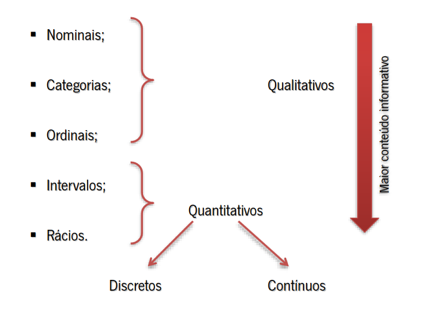

# Preparação de Dados

A preparação de dados é uma etapa fundamental em qualquer projeto de _Data Science_ e _Machine Learning_. Esta etapa é responsável por preparar os dados de forma a que estes possam ser utilizados por algoritmos de aprendizagem automática. A preparação de dados é uma etapa demorada e que requer um conhecimento profundo dos dados e do problema em questão.

Os dados têm de ser formatados de forma a se adequarem a uma determinada ferramenta ou algoritmo. Esta formatação pode incluir a remoção de _outliers_, a normalização dos dados, a codificação de variáveis categóricas, entre outras tarefas.

## Porquê Preparar os Dados?

Os dados recolhidos do mundo real podem conter diversos problemas, tais como:

- **_Missing Values_**: valores em falta;
- **_Outliers_**: valores extremos que não seguem o padrão dos restantes valores;
- **_Data Imbalance_**: desequilíbrio entre as classes;
- **_Data Inconsistency_**: inconsistência nos dados;
- **_Data Irrelevance_**: dados irrelevantes para o problema em questão;
- **_Data Redundancy_**: dados redundantes;
- **_Data Noise_**: ruído nos dados.
- ...

Estes problemas podem afetar a performance dos algoritmos de aprendizagem automática, pelo que é necessário tratá-los antes de aplicar os mesmos.

## Etapas de Preparação de Dados

As etapas de preparação de dados podem variar de acordo com o problema em questão, mas, de uma forma geral, incluem as seguintes tarefas:

1. **Discretização/Enumeração:**
    - Redução de dados com importante aplicação a dados numéricos;
    - Transformação de dados contínuos em dados discretos;
    - Agrupamento de valores em intervalos;
    - ...

2. **Limpeza de Dados:**
    - Preenchimento de valores de atributos em falta;
    - Remoção de lixo dos dados;
    - Remoção de valores impossíveis;
    - Resolução de inconsistências;
    - ...

3. **Integração de Dados:**
    - Integração de múltiplas fontes de dados.

4. **Transformação de Dados:**
    - Normalização de dados;
    - Transformação de dados categóricos em dados numéricos;
    - Agregação de dados;
    - ...

5. **Redução de Dados:**
    - Obtenção de representações de dados menos volumosas, mas com capacidade para produzir os mesmos resultados;
    - Redução de dimensionalidade;
    - Compresão de dados;
    - ...

## Discretização/Enumeração

Utiliza-se discretização para reduzir o número de valores possíveis de um atributo contínuo, dividindo-o em intervalos:

- Os métodos mais utilizados (Naive Bayes, CHAID, etc.) requerem que os atributos sejam discretos;
- Redução do tamanho dos dados;
- Método utilizado para reduzir sumariação dos dados.

### Métodos de Discretização

1. **_Equal Width Binning_**:
    - Divide o intervalo dos valores em `k` intervalos de largura igual;
    - A largura de cada intervalo é dada por: `w = (max - min) / k`.

**Vantagens:**

- Simples e rápido;
- Não sensível a _outliers_.

**Desvantagens:**

- Sensível à distribuição dos dados;
- Pode não ser eficaz para dados com distribuição não uniforme.

2. **_Equal Height Binning_**:
    - Divide o intervalo dos valores em `k` intervalos de altura igual;
    - Cada intervalo contém, aproximadamente, o mesmo número de valores.
    - Deverá criar intervalos separados para valores especiais "0".

**Vantagens:**

- Não sensível à distribuição dos dados.

**Desvantagens:**

- Pode ser sensível a _outliers_;
- Pode não ser eficaz para dados com distribuição não uniforme.

## Limpeza de Dados

A limpeza de dados é uma etapa fundamental na preparação de dados. Esta etapa é responsável por remover ou corrigir valores incorretos, incompletos ou inconsistentes. A ausência de dados pode revelar algo sobre que campos não foram preenchidos, mas também pode ser um problema para a análise de dados.

### Como tratar a ausência de dados?

1. Ignorar os registos onde faltam dados e lidar apenas com os registos completos:
    - **Vantagens:**
        - Simples;
        - Não requer qualquer tipo de tratamento.
    - **Desvantagens:**
        - Perda de informação;
        - Pode levar a resultados enviesados.

2. Ignorar os atributos onde faltam dados:
    - **Vantagens:**
        - Simples;
        - Não requer qualquer tipo de tratamento.
    - **Desvantagens:**
        - Perda de informação;
        - Não aconselhável se o atributo for relevante.

3. Preencher (manualmente) os valores em falta:
    - **Vantagens:**
        - Pode ser útil se o número de valores em falta for pequeno.
    - **Desvantagens:**
        - Moroso;
        - Pode ser difícil de determinar o valor a preencher.

4. Preencher os valores em falta com o mesmo valor:
    - **Vantagens:**
        - Simples;
        - Não requer qualquer tipo de tratamento.
    - **Desvantagens:**
        - Pode criar tendências nos dados.

5. Preencher os valores em falta com a média, mediana ou moda:
    - **Vantagens:**
        - Simples;
        - Não requer qualquer tipo de tratamento.
    - **Desvantagens:**
        - Pode criar tendências nos dados.

Quantos mais valores "inventados", maior o desvio dos dados que caracterizam o problema face à realidade que o mesmo ilustra.

## Integração de Dados

A integração de dados é o processo de combinar dados de diferentes fontes para fornecer uma visão unificada dos mesmos. Esta etapa é necessária quando os dados são provenientes de múltiplas fontes e é necessário combiná-los para obter uma visão global dos mesmos.

## Transformação de Dados

A transformação de dados é o processo de converter os dados de um formato para outro. Esta etapa é necessária para preparar os dados para serem utilizados por algoritmos de aprendizagem automática. A transformação de dados pode incluir a normalização dos dados, a codificação de variáveis categóricas, entre outras tarefas.

### Tipos de Transformação de Dados

1. **Alisamento:**
    - Remoção de lixo/ruído dos dados.
    - Exemplo: remover valores impossíveis.

2. **Agregação:**
    - Combinação de dois ou mais atributos para criar um novo atributo.
    - Exemplo: transformar "idade" e "género" em "faixa etária".

3. **Generalização:**
    - Hierarquização de conceitos.
    - Exemplo: transformar "idade" em "jovem", "adulto" e "idoso".

4. **Construção de Atributos:**
    - Criação de novos atributos a partir dos atributos existentes.
    - Exemplo: criar um atributo "idade" a partir da data de nascimento.

5. **Uniformização:**
    - Conversão de valores de atributos para uma escala comum.
    - Exemplo: normalização dos dados, padronização dos dados, etc.

6. **Deteção de valores atípicos:**
    - Identificação e remoção de valores atípicos.
    - Exemplo: remoção de _outliers_.

## Redução de Dados

A redução de dados é o processo de obter representações de dados menos volumosas, mas com capacidade para produzir os mesmos resultados. Esta etapa é necessária para reduzir a complexidade dos dados e melhorar a eficiência dos algoritmos de aprendizagem automática.

### Métodos de Redução de Dados

1. **Construção de cubos de dados:**
    - As operações de agregação são realizadas para criar cubos de dados.
    - Exemplo: criação de cubos de dados para armazenar dados agregados por região, por produto, etc.

2. **Redução de dimensionalidade:**
    - Remoção de atributos que se mostram irrelevantes, redundantes ou pouco interessantes para o problema em questão.
    - Exemplo: seleção de atributos, extração de atributos, etc.

3. **Compressão de dados:**
    - Aplicação de técnicas de compressão de dados para reduzir o tamanho dos mesmos.
    - Mantendo a informação relevante.

4. **Redução de quantidade:**
    - Redução do volume de dados.
    - Exemplo: amostragem, agregação, etc.

5. **Discretização e generalização de conceitos:**
    - Redução do número de valores possíveis de um atributo.
    - Exemplo: discretização de atributos contínuos, etc.

# Tipos de Dados

Os dados podem ser classificados em 2 tipos:

- **Dados Qualitativos:** dados que representam qualidades, tais como cores, géneros, etc.

- **Dados Quantitativos:** dados que representam quantidades, tais como números.

Por sua vez, os mesmos podem ainda ser divididos em diversos tipos:

- **Nominais:**
    - atribui nomes únicos a objetos;
    - não existe outra informação que se possa inferir a partir dos dados;
    - exemplos: nomes de pessoas, cores, etc.

- **Categorias:**
    - atribui categorias a objetos;
    - podem ser valores numéricos, mas são **não ordenados**;
    - exemplos: categorias de carros, tamanhos de roupa, etc.

- **Ordinais:**
    - os valores podem ser ordenados naturalmente;
    - exemplos: temperaturas (frio, morno, quente), etc.

- **Intervalos:**
    - a diferença entre os valores é significativa;
    - não existe um zero absoluto;
    - é possível calcular a distância entre os valores;
    - exemplos: temperaturas em graus Celsius, etc.

- **Rácios:**
    - os valores podem ser utilizados para determinar um rácio significativo;
    - existe um zero absoluto;
    - exemplos: temperaturas em graus Kelvin, etc.

