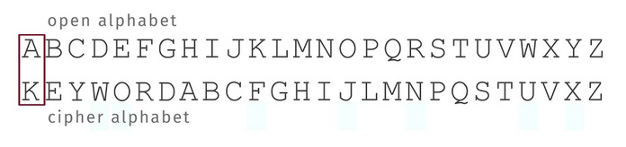

# Criptografia

## O que é uma cifra?

Uma cifra é um algoritmo que é usado para cifrar e decifrar mensagens. Cifras são usadas para proteger a confidencialidade de mensagens e para criptografar mensagens de modo que apenas o destinatário possa decifrá-las. Para além disso, são ainda usadas para proteger a integridade de mensagens e para autenticar a origem de mensagens.
Resumidamente, uma cifra é um algortimo que permite transformar **plaintext** em **ciphertext**.

## Diferentes Tipos de Cifras

### Cifra de Cáesar

Cifra usada por Júlio César para comunicar com os seus generais. Esta cifra consiste em realizar um shift de um certo número de posições no alfabeto. Por exemplo, se o shift for de 3 posições, a letra A seria cifrada como D, a letra B como E, e assim sucessivamente.

Para decifrar a mensagem, basta realizar o shift inverso.

O número total de chaves possíveis é 26, uma vez que o alfabeto tem 26 letras.

#### Ataque à Cifra de César

Há duas principais formas de atacar a cifra de César:

1. **Ataque de Força Bruta**: Testar todas as chaves possíveis até encontrar a chave correta. É assumido que há redundância o sufiiente na mensagem para que o atacante consiga identificar a chave correta, bem como o conhecimento de um par plaintext-ciphertext. O ataque de força bruta é sempre uma opção viável para qualquer cifra, no entanto, a sua eficácia depende da complexidade da cifra (número de chaves possíveis) e da quantidade de informação disponível ao atacante.

2. **Análise de Frequência**: Este ataque baseia-se na frequência de ocorrência de letras no alfabeto. Por exemplo, a letra mais comum em português é o A, seguida do E, do O, e assim sucessivamente. Assim, se o atacante souber que a língua em que a mensagem foi escrita é português, pode tentar decifrar a mensagem com base na frequência de ocorrência de letras.

### Cifra de Substituição Monoalfabética

Neste tipo de cifra, cada letra do alfabeto é substituída por outra letra. Por exemplo, a letra A pode ser substituída por D, a letra B por E, e assim sucessivamente. A grande diferença em relação à cifra de César é que, neste caso, a substituição é feita de forma aleatória.



Nesta cifra, o número de chaves possíveis já é muito maior, uma vez que é possível permutar as 26 letras do alfabeto de 26! formas diferentes, ou seja, 26! = 17.5 * 10^24 possíveis chaves.

#### Ataque à Cifra de Substituição Monoalfabética

Como o número de chaves possíveis é muito grande, o ataque de força bruta torna-se inviável. No entanto, o ataque de análise de frequência continua a ser uma opção viável, uma vez que a frequência de ocorrência de letras no alfabeto não é alterada.

### Cifra de Vigenère (Polialfabética)

A cifra de Vigenère é uma extensão da cifra de César, em que a chave é uma password de tamanho variável. Cada letra da chave é usada para cifrar uma letra do plaintext, de acordo com um shift variável (A = 0, B = 1, ..., Z = 25). Quando a chave termina, esta é repetida até ao fim do plaintext.

Umas das principais vantagens da cifra de Vigenère é que o número de chaves possíveis é muito maior do que na cifra de César, uma vez que a chave pode ter um tamanho variável. Para além disso, a mesma letra do plaintext pode ser cifrada de formas diferentes, dependendo da posição da letra na chave, no entanto, se o tamanho do chave for pequeno, ou o tamanho do plaintext for grande, podem surgir padrões que podem ser explorados pelo atacante.

### Cifra de Transposição

Neste tipo de cifra, as letras do plaintext são reorganizadas de acordo com uma regra predefinida. Por exemplo, se a chave for constituida por 5 elementos, [3, 1, 4, 2, 5], o conteúdo do plaintext seria reorganizado numa matriz com 5 colunas e n linhas, e as letras seriam lidas por coluna. A ordem pela qual as colunas são lidas é dada pela chave.

```
Plaintext:  CRYPTOGRAPHYISFUN
Chave:      [3, 1, 4, 2, 5]

3 1 4 2 5
---------
C R Y P T
O G R A P
H Y I S F
U N

Ciphertext: RGYNPASCOHUYRITPF (lido por coluna, de 1-5)
```

Uma vantagem do uso desta cifra é que torna a análise de frequência ineficaz, uma vez que as letras do plaintext são reorganizadas. No entanto, a cifra de transposição é vulnerável a ataques de força bruta, uma vez que o número de chaves possíveis é relativamente pequeno.

### Cifra One-Time Pad

A cifra One-Time Pad é uma extensão da cifra de Vigenère, em que a chave é, pelo menos, tão grande quanto o plaintext, é usada apenas uma vez e é totalmente random. É considerada segura, uma vez que o ciphertext é completamente aleatório, e não há qualquer padrão que possa ser explorado pelo atacante.
No entanto, a geração e distribuição de chaves aleatórias é um problema que torna o uso desta cifra inviável em cenários realistas.

## Conclusões

Na cripto-análise, é importante ter em conta toda a informação disponível ao atacante, bem como a complexidade da cifra. O ataque de força bruta é sempre uma opção viável, no entanto, a sua eficácia depende da complexidade da cifra e da quantidade de informação disponível ao atacante. O ataque de análise de frequência é uma opção viável para cifras que não alteram a frequência de ocorrência de letras no alfabeto.

## Criptografia Simétrica vs Assimétrica

### Criptografia Simétrica

Na criptografia simétrica, a mesma chave é usada para cifrar e decifrar a mensagem. A chave é partilhada entre o emissor e o recetor, e é usada por ambos no processo de cifragem e decifragem da mensagem. A principal vantagem da criptografia simétrica é a sua eficiência, uma vez que a cifra e a decifra são operações rápidas. No entanto, a distribuição de chaves é um problema que pode ser difícil de resolver

### Criptografia Assimétrica

Na criptografia assimétrica, são usadas duas chaves: uma chave pública e uma chave privada. A chave pública é usada para cifrar a mensagem, e a chave privada é usada para decifrar a mesma. A chave pública é partilhada com todos, enquanto que a chave privada é mantida em segredo, sendo que a principal vantagem da criptografia assimétrica é a facilidade de distribuição de chaves, uma vez que a chave pública pode ser partilhada com todos. No entanto, a cifra e a decifra são operações mais lentas do que na criptografia simétrica.

## Propriedades de Segurança

### Confidencialidade

A confidencialidade é a propriedade que garante que apenas o destinatário da mensagem consegue decifrá-la. A confidencialidade é garantida através do uso de cifras, que permitem cifrar a mensagem de modo a que apenas o destinatário consiga decifrá-la.

### Integridade

A integridade é a propriedade que garante que a mensagem não foi alterada durante a transmissão.

### Autenticidade

A autenticidade é a propriedade que garante que a mensagem foi enviada por quem diz ser.

### Não-Repúdio

O não-repúdio é a propriedade que garante que o emissor da mensagem não pode negar o envio da mesma.

## Anonimato

O anonimato é a propriedade que garante que a identidade do emissor da mensagem é desconhecida.

## Servicos e Protocolos de Criptografia

Usualmente, é de interesse geral que diversas propriedades de segurança sejam garantidas. No entanto, várias das mesmas não podem ser garantidas recorrendo apenas a uma única técnica de criptografia. Assim, é comum a utilização de várias técnicas de criptografia em conjunto, de modo a garantir um maior nível de segurança. Foi assim que surgiram os serviços e protocolos de criptografia, que permitem garantir várias propriedades de segurança em simultâneo, a partir da junção de várias técnicas de criptografia.

## Cifras de Fluxo

As cifras de fluxo são caracterizadas por cifrar um bit/byte de cada vez, em vez de um bloco de bits. A cifra de fluxo gera uma sequência de bits pseudo-aleatória, que é combinada com o plaintext (XOR) para gerar o ciphertext.

A sequência pseudo-aleatória é gerada a partir de uma chave secreta, e é usada apenas uma vez e a mesma deve ser sempre pelo menos do tamanho do plaintext e o seu periodo deve ser suficientemente grande para garantir a segurança da cifra (não deve iniciar uma segunda iteração no mesmo plaintext).

A sequência da chave deve ser:

1. **Pseudo-aleatória**: A sequência de bits gerada deve ser pseudo-aleatória, ou seja, mesmo que seja determinística, deve parecer aleatória.

2. **Impossível de Prever**: A sequência de bits gerada deve ser impossível de prever, mesmo sabendo o que vem antes na sequência.

Este tipo de cifras podem ser divididas em dois tipos:

1. **Síncronas**: A sequência de bits gerada é independente da mensagem. A sequência de bits é gerada a partir de uma chave secreta, e é combinada com o plaintext (XOR) para gerar o ciphertext.

2. **Auto-Sincornizáveis**: Deve ser capaz de recuperar o sincronismo após perda de bits do ciphertext.


### Cifras de Fluxo Síncronas

A **keystream** é gerada é independente da mensagem e a perda ou inserção de bits no criptograma resulta na perda de sincronismo.
Erros de transmissão afetam apenas a posição correspondente no texto decifrado.

A chave poderá afetar:

1. A próxima função de estado - **Output Feedback Mode (OFB)**
2. A função do output - **Counter Mode (CTR)**

### Cifras de Fluxo Auto-Sincronizáveis

O próximo bit é computado recorrendo aos últimos n bits do ciphertext e da chave. É utilizado um IV(Initialization Vector) para iniciar o processo de cifragem e, em caso de erro de transmissão, o sincronismo é recuperado quando o flipped bit já não é utilizado para cifrar o próximo bit.

Uma desvantagem é a sua vulnerabilidade a _replay attacks_.

## Reutilização de Chaves e NONCEs

As cifras de fluxo apresentadas anteriormente apresentam a mesma vulnerabilidade do One-Time Pad, ou seja, a reutilização de chaves.

Este problema é geralmente resolvido recorrendo a um **NONCE** (Number used Once), que é um número aleatório que é usado apenas uma vez. O NONCE é combinado com a chave para gerar a sequência de bits pseudo-aleatória, e é enviado juntamente com o ciphertext. Não é necessário que o NONCE seja secreto, apenas que seja único.

## Cifras de Bloco

As cifras de bloco são caracterizadas por cifrar um bloco de bits de cada vez, em vez de um bit/byte. O bloco de bits é cifrado de acordo com uma chave secreta, e o mesmo bloco de bits é cifrado sempre da mesma forma.

Existem diversos modos de operação para cifras de bloco, que permitem garantir a confidencialidade, integridade, autenticidade e não-repúdio de mensagens.

### Design de Cifras de Bloco

São duas as propriedades que uma cifra de bloco deve garantir:

1. **Difusão**: A difusão é a propriedade que garante que uma pequena alteração no plaintext resulta numa grande alteração no ciphertext. A difusão é garantida através da aplicação de várias rondas de substituição e permutação.

2. **Confusão**: A confusão é a propriedade que garante que a relação entre o ciphertext e a chave é o mais complexa possível.

Grande parte dos designs são cifras iterativas, ou seja, são compostas por várias rondas de substituição e permutação. A cifra DES, por exemplo, é composta por 16 rondas de substituição e permutação.

## Cifras de Bloco vs Cifras de Fluxo

- Utilizam diferentes "processing units" (bloco vs bit/byte);

- O uso de cifras de bloco depende de um modo de operação, enquanto que as cifras de fluxo não;

- As cifras de fluxo não promovem a difusão;

- As cifras de fluxo são, normalmente, mais rápidas do que as cifras de bloco.

- O processo de decifragem nas cifras de bloco é mais complexo do que nas cifras de fluxo (em que é apenas necessário fazer XOR).

## Modos Básicos de Operação

Uma cifra de blocos, por si só, só é capaz de processar blocos de tamanho fixo.
Os modos de operação definem como os blocos são cifrados e decifrados, dependendo das aplicações, podemos escolher entre diferentes modos de operação:

- **Electronic Codebook (ECB)**;
- **Cipher Block Chaining (CBC)**;
- **Counter Mode (CTR)**;
- etc...

Cada modo de operação tem as suas vantagens e desvantagens, e é importante escolher o modo de operação mais adequado para a aplicação em questão.

## Padding

Existem diversos modos de operação que requerem que o tamanho do plaintext seja múltiplo do tamanho do bloco. No entanto, nem sempre o tamanho do plaintext é múltiplo do tamanho do bloco, e é necessário adicionar bits adicionais ao plaintext de modo a que o tamanho do plaintext tenha o tamanho correto. 

Assim surge o conceito de **padding**, que consiste em adicionar bits adicionais ao plaintext de modo a que o tamanho do plaintext seja múltiplo do tamanho do bloco.

## Eletronic Codebook (ECB)

O modo de operação ECB é o mais simples de todos, e consiste em cifrar cada bloco de bits de forma independente. O principal problema deste modo de operação é que blocos iguais de plaintext resultam em blocos iguais de ciphertext, o que pode ser explorado pelo atacante. Este modo requer o uso de padding e deve ser apenas utilizado para cifrar mensagens com um único bloco.

## Cipher Block Chaining (CBC)

Cada bloco do plaintext é escondido com o bloco anterior do ciphertext, o que impede que blocos iguais de plaintext resultem em blocos iguais de ciphertext. O primeiro bloco é escondido com um IV (Initialization Vector), que é um bloco de bits aleatório. O IV é enviado juntamente com o ciphertext, e é usado para decifrar o primeiro bloco. Tal como os NONCEs, o IV não precisa de ser secreto, apenas único.


## Cipher Feedback (CFB)

O modo de operação CFB é semelhante ao modo de operação CBC, no entanto, em vez de esconder o bloco de plaintext com o bloco anterior do ciphertext, o bloco de plaintext é escondido com a saída da cifra. O modo de operação CFB é normalmente utilizado para cifras de fluxo, e é mais eficiente do que o modo de operação CBC. É implementada uma cifra auto-sincronizável e não é necessário o uso de padding. A keystream depende da key, do IV e de todos os plaintexts anteriores.

## Output Feedback (OFB)

Implementa uma cifra de fluxo síncrona, em que a keystream é gerada independentemente do plaintext. O modo de operação OFB é semelhante ao modo de operação CFB, no entanto, em vez de esconder o bloco de plaintext com a saída da cifra, a cifra de bloco é usada como a função de estado da cifra.

## Counter Mode (CTR)

Implementa uma cifra de fluxo síncrona, em que a keystream é gerada independentemente do plaintext. A função do próximo bloco é calculada a partir de um contador e a cifra de bloco é usada como função de output.
A alteração de um bit no ciphertext resulta na alteração de um bit no plaintext.

## Encriptação Autenticada

Um movimento que tem vindo a ganhar força é a adoção de modos de operação de cifras de bloco que garantem tanto a confidencialidade como a integridade da mensagem. Estes modos de operação são conhecidos como modos de encriptação autenticada, e garantem que a mensagem não foi alterada durante a transmissão.

Alguns exemplos:

- **EAX(Encrypt-then-Authenticate-then-XOR)**;
- **CCM(Counter with CBC-MAC)**;
- **GCM(Galois/Counter Mode)**;
- **OCB(Offset Codebook Mode)**;
- etc...

## Advanced Encryption Standard (AES)


